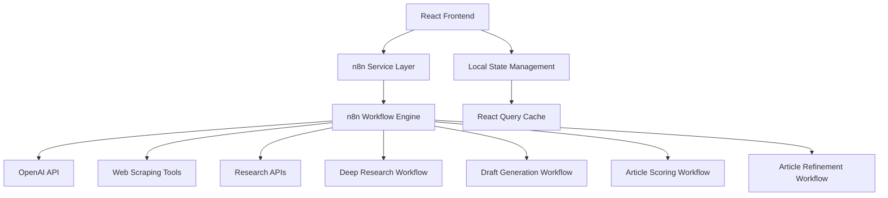

# Hiredly Composer - Technical Overview & Improvement Guide

## Table of Contents
1. [System Overview](#system-overview)
2. [Architecture](#architecture)
3. [Frontend Application](#frontend-application)
4. [n8n Workflow Analysis](#n8n-workflow-analysis)
5. [Service Integration](#service-integration)
6. [Current Implementation Status](#current-implementation-status)
7. [Improvement Recommendations](#improvement-recommendations)
8. [Development Workflow](#development-workflow)

---

## System Overview

Hiredly Composer is an AI-powered research article writing tool that streamlines the process of researching, drafting, and finalizing high-quality articles. The system follows a 5-step workflow:

1. **Keywords Analysis** - User input processing and keyword extraction
2. **Research & Source Discovery** - Deep research using AI and web scraping
3. **Source Review** - Link validation and source quality assessment
4. **Draft Generation** - AI-powered article creation with citations
5. **Quality Analysis & Refinement** - Article scoring and iterative improvement

### Key Technologies
- **Frontend**: React 18 + TypeScript + Vite + Tailwind CSS + shadcn/ui
- **Backend Orchestration**: n8n workflows
- **AI Integration**: OpenAI API (GPT-4.1, O4-mini)
- **State Management**: React Query + Custom hooks
- **Real-time Communication**: WebSocket (planned)

---

## Architecture



### Data Flow
1. User inputs keywords/query in React frontend
2. Frontend calls n8n service layer with standardized API
3. n8n orchestrates multiple workflows based on step
4. Each workflow calls external APIs (OpenAI, research databases)
5. Results flow back through n8n to frontend
6. Frontend updates UI with real-time progress and results

---

## Frontend Application

### Project Structure
```
src/
├── components/
│   ├── steps/              # Step-specific components
│   │   ├── KeywordsStep.tsx      # Step 1: Query input
│   │   ├── ResearchStep.tsx      # Step 2: Research execution
│   │   ├── SourceReviewStep.tsx  # Step 3: Source validation
│   │   ├── DraftStep.tsx         # Step 4: Article generation
│   │   ├── FinalStep.tsx         # Step 5: Scoring & refinement
│   │   └── ScoreRefineStep.tsx   # Quality analysis UI
│   ├── ui/                 # Reusable UI components (shadcn/ui)
│   ├── ResearchArticleApp.tsx    # Main app orchestrator
│   ├── LoadingOverlay.tsx        # Loading states
│   └── ProgressIndicator.tsx     # Step progress bar
├── hooks/
│   ├── use-workflow.ts     # Main workflow state management
│   ├── use-toast.ts        # Toast notifications
│   └── use-mobile.tsx      # Responsive utilities
├── lib/
│   ├── n8n-service.ts      # n8n API integration layer
│   ├── link-validator.ts   # URL validation utilities
│   └── utils.ts            # General utilities
└── pages/
    ├── Index.tsx           # Landing page
    └── NotFound.tsx        # 404 page
```

### Core Components Analysis

#### 1. ResearchArticleApp.tsx (Main Orchestrator)
**Purpose**: Central app component that manages the 5-step workflow
**Key Features**:
- Step-based navigation (0-4)
- Loading state management
- Error handling with toast notifications
- Progress tracking
- Responsive design

**Current Implementation**:
```typescript
const steps = ['Keywords', 'Research', 'Source Review', 'Draft', 'Final'];
const renderCurrentStep = () => {
  switch (currentStep) {
    case 0: return <KeywordsStep workflowManager={workflowManager} />;
    case 1: return <ResearchStep workflowManager={workflowManager} />;
    // ... other steps
  }
};
```

#### 2. Workflow State Management (use-workflow.ts)
**Purpose**: Centralized state management for the entire workflow
**Key Features**:
- React Query integration for API calls
- Progress tracking
- Error handling
- Step transitions
- Mock data for development/testing

**State Structure**:
```typescript
interface WorkflowState {
  currentStep: number;
  executionId: string | null;
  keywordsData: KeywordsRequest | null;
  researchData: Source[] | null;
  deepResearchData: DeepResearchFact[] | null;
  draftData: ArticleContent | null;
  qualityData: QualityMetrics | null;
  feedback: string | null;
  isLoading: boolean;
  error: string | null;
  progress: number;
}
```

#### 3. n8n Service Layer (n8n-service.ts)
**Purpose**: Abstraction layer for all n8n workflow communications
**Key Features**:
- RESTful API wrapper
- Timeout handling
- Progress tracking via WebSocket
- Type-safe interfaces
- Error handling

**API Methods**:
- `processKeywords()` - Step 1: Keyword processing
- `executeDeepResearchWorkflow()` - Step 2: Deep research
- `analyzeSources()` - Step 3: Source analysis
- `generateDraft()` - Step 4: Draft generation
- `analyzeQuality()` - Step 5a: Quality scoring
- `refineDraft()` - Step 5b: Draft refinement

---

## n8n Workflow Analysis

### 1. Deep Research Workflow (`deep-research.json`)

**Purpose**: Conduct AI-powered research to find facts and sources
**Webhook Endpoint**: `/webhook/deep-research`

**Flow Analysis**:
```
Webhook Input → Generate Session ID → Set Keyword → Add System Prompt 
→ Get All Messages → Construct OpenAI Messages → Call OpenAI API 
→ Parse JSON Output → Aggregate → Format Response
```

**Key Components**:
- **Input**: `{ keyword: string }`
- **AI Model**: O4-mini with web search tools
- **Output**: Array of facts with headings, summaries, evidence, and sources
- **Memory Management**: Uses session-based memory for context

**System Prompt Analysis**:
```
You are a helpful SEO writer. Your job is to research keywords and find verifiable facts.
For each fact, you MUST provide:
- heading: Clear, concise heading
- summary: Brief summary
- evidence: Supporting text
- source: Direct, full URL (http/https)

Minimum 5 sources, ideally 10 sources.
Output format: JSON array
```

**Strengths**:
- Structured JSON output
- Web search integration
- Memory management for context
- Clear fact extraction format

**Areas for Improvement**:
- No source quality validation
- Limited to OpenAI's web search
- No duplicate detection
- No domain filtering

### 2. Draft Generator Workflow (`draft-generator.json`)

**Purpose**: Generate SEO-optimized article drafts from research facts
**Webhook Endpoint**: `/webhook/generate-draft`

**Flow Analysis**:
```
Webhook Input → Generate Session ID → Prepare AI Data → Add System Prompt 
→ Get All Messages → Construct OpenAI Messages → Call OpenAI API → Parse Output
```

**Key Components**:
- **Input**: `{ query: string, facts: DeepResearchFact[] }`
- **AI Model**: GPT-4.1 with web search tools
- **Output**: Structured article with title, content, citations
- **Strict Requirements**: 1000-1400 words, specific formatting rules

**System Prompt Analysis** (Extensive):
- **Role**: Experienced human copywriter (not AI)
- **Structure Requirements**: H1 with keywords, H2/H3 with Who/What/Why/How
- **Length**: 1000-1400 words, max 4 lines per paragraph
- **SEO**: Primary keywords in H1 and subheadings
- **Citations**: Clickable Markdown links with specific format
- **References**: Structured reference list
- **Fail Conditions**: Automatic rewrite triggers for violations

**Strengths**:
- Comprehensive content guidelines
- SEO optimization built-in
- Proper citation handling
- Quality control measures

**Areas for Improvement**:
- Very rigid constraints may limit creativity
- No tone/style customization
- Single model dependency
- No content plagiarism check

### 3. Article Scoring Workflow (`[SEO Tool] Article Scoring Workflow.json`)

**Purpose**: Evaluate article quality on multiple metrics
**Webhook Endpoint**: `/webhook/score-article`

**Flow Analysis**:
```
System Prompt → Get Messages → Construct OpenAI Messages → Call OpenAI API 
→ Parse Structured Output → Return Evaluation
```

**Key Components**:
- **Input**: `{ article: string }`
- **AI Model**: GPT-4.1-mini with code interpreter
- **Output**: Structured JSON with scores and feedback
- **Metrics**: Conciseness, Coherence, paragraph length, word count

**Evaluation Criteria**:
- **Conciseness & Coherence**: 1-5 scale scores
- **Paragraph Length**: 75% must have ≤5 sentences
- **Word Count**: ~1000 words (20% margin)
- **Pass Condition**: ≥4.0 for both scores + structure compliance

**Strengths**:
- Objective scoring criteria
- Code interpreter for accurate counting
- Structured JSON output
- Clear pass/fail logic

**Areas for Improvement**:
- Limited to 2 main metrics
- No SEO scoring
- No readability analysis
- No citation quality check

### 4. Article Refinement Workflow (`[SEO Tool] Article Refinement Workflow.json`)

**Purpose**: Improve articles based on evaluation feedback
**Webhook Endpoint**: `/webhook/refine-article`

**Flow Analysis**:
```
Insert Feedback → Get All Messages → Construct OpenAI Messages 
→ Call OpenAI API → Extract Refined Article
```

**Key Components**:
- **Input**: Original article + feedback
- **AI Model**: GPT-4.1-mini
- **Output**: Improved article text
- **Process**: Applies specific feedback to enhance content

**Strengths**:
- Iterative improvement capability
- Feedback-driven refinement
- Memory management for context

**Areas for Improvement**:
- No validation of improvements
- Single iteration only
- No A/B testing of changes
- No improvement tracking

### 5. Article Scoring Endpoint (`[SEO Tool] Article Scoring Endpoint.json`)

**Purpose**: Simple webhook endpoint wrapper for scoring workflow
**Flow**: `Webhook → Extract Article → Execute Scoring Workflow → Format Response`

---

## Service Integration

### Current Integration Points

1. **OpenAI API Integration**:
   - Models: GPT-4.1, GPT-4.1-mini, O4-mini
   - Features: Web search, code interpreter
   - Authentication: Bearer token
   - Timeout: Configurable per workflow

2. **n8n Workflow Engine**:
   - Local instance: `http://localhost:5678`
   - Webhook-based communication
   - Session management for AI memory
   - Progress tracking (planned WebSocket)

3. **Frontend-Backend Communication**:
   - RESTful API calls
   - JSON data exchange
   - Error handling with retry logic
   - Mock data for development

### Data Models

#### Core Types
```typescript
interface KeywordsRequest {
  query: string;
  tags: string[];
  language: string;
  depth: number;
  explodedResults: boolean;
}

interface DeepResearchFact {
  heading: string;
  summary: string;
  evidence: string;
  source: string;
}

interface Source {
  id: string;
  title: string;
  excerpt: string;
  domain: string;
  url: string;
  favicon: string;
  score: number;
  type: 'academic' | 'web' | 'news' | 'report';
}

interface ArticleContent {
  title: string;
  content: string;
  citations: Citation[];
  outline: OutlineItem[];
  metrics?: QualityMetrics;
}
```

---

## Current Implementation Status

### ✅ Completed Features
1. **Frontend Framework**: React + TypeScript + Tailwind
2. **UI Components**: Complete shadcn/ui component library
3. **State Management**: React Query + custom workflow hooks
4. **Step-based Navigation**: 5-step workflow with progress tracking
5. **n8n Integration**: Service layer with type-safe APIs
6. **Workflow Orchestration**: 4 complete n8n workflows
7. **AI Integration**: OpenAI API with multiple models
8. **Mock Data System**: Development and testing capabilities
9. **Error Handling**: Comprehensive error management
10. **Responsive Design**: Mobile-friendly UI

### 🚧 Partial Implementation
1. **Progress Tracking**: WebSocket setup exists but not fully connected
2. **Source Validation**: Basic link validator exists but not integrated
3. **Export Features**: Planned but not implemented
4. **Real-time Updates**: Framework exists but needs connection

### ❌ Missing Features
1. **Authentication & User Management**
2. **Data Persistence** (browser storage only)
3. **Advanced SEO Analysis**
4. **Plagiarism Detection**
5. **Multi-language Support**
6. **Article Templates**
7. **Collaboration Features**
8. **Analytics & Reporting**

---

## Improvement Recommendations

### Immediate Improvements (Priority 1)

#### 1. Enhanced Error Handling & Logging
**Current Issue**: Limited error visibility and debugging capability
**Recommended Solution**:
```typescript
// Add structured logging throughout workflows
interface ErrorLog {
  timestamp: string;
  step: string;
  error: string;
  context: any;
  userId?: string;
}

// Implement in n8n workflows
const logError = (step: string, error: any, context: any) => {
  // Send to logging service
  console.error({ timestamp: new Date().toISOString(), step, error, context });
};
```

#### 2. Progress Tracking Implementation
**Current Issue**: WebSocket progress tracking is planned but not connected
**Recommended Solution**:
- Implement WebSocket connection in n8n workflows
- Add progress events at each major step
- Create real-time progress bar updates
- Add estimated time remaining

#### 3. Source Quality Enhancement
**Current Issue**: No source validation or quality scoring
**Recommended Solution**:
```typescript
interface SourceQuality {
  domainAuthority: number;
  publishDate?: Date;
  authorCredibility: number;
  contentRelevance: number;
  citationCount?: number;
}

// Implement source scoring in research workflow
const scoreSource = async (source: Source): Promise<SourceQuality> => {
  // Domain authority check
  // Publish date extraction
  // Author verification
  // Content relevance analysis
};
```

### Medium-term Improvements (Priority 2)

#### 1. Advanced Content Analysis
**Enhancement Areas**:
- **SEO Scoring**: Keyword density, meta descriptions, header structure
- **Readability Analysis**: Flesch-Kincaid, grade level, sentence complexity
- **Plagiarism Detection**: Content originality verification
- **Fact Checking**: Source credibility and claim verification

**Implementation Approach**:
```typescript
interface ContentAnalysis {
  seoScore: SEOMetrics;
  readabilityScore: ReadabilityMetrics;
  plagiarismCheck: PlagiarismResult;
  factCheck: FactCheckResult;
}

// Add to article scoring workflow
const analyzeContent = async (content: string): Promise<ContentAnalysis> => {
  // Implement multiple analysis services
};
```

#### 2. Multi-Model AI Integration
**Current Limitation**: Heavy dependence on OpenAI models
**Recommended Solution**:
- Add Claude (Anthropic) integration for comparison
- Implement Google Gemini for research tasks
- Add fallback models for reliability
- Create model selection based on task type

#### 3. Enhanced Research Capabilities
**Improvements**:
- **Academic Database Integration**: Direct PubMed, arXiv, Google Scholar APIs
- **Real-time Web Scraping**: Dynamic content extraction
- **Social Media Research**: Twitter, Reddit, LinkedIn insights
- **News API Integration**: Recent developments and trends

### Long-term Improvements (Priority 3)

#### 1. User Management & Personalization
**Features to Add**:
- User authentication system
- Personal research history
- Custom templates and preferences
- Collaborative workspaces
- Usage analytics and insights

#### 2. Advanced Workflow Features
**Enhancements**:
- **Branching Workflows**: A/B testing different approaches
- **Conditional Logic**: Smart routing based on content type
- **Bulk Processing**: Multiple articles simultaneously
- **Template System**: Pre-defined article structures
- **Version Control**: Track article iterations

#### 3. Enterprise Features
**Scalability Improvements**:
- **Multi-tenant Architecture**: Organization management
- **API Rate Limiting**: Fair usage policies
- **Custom Model Training**: Organization-specific AI models
- **Advanced Analytics**: Performance dashboards
- **Integration Hub**: CMS, publishing platform connections

### Technical Debt & Code Quality

#### 1. TypeScript Improvements
**Current Issues**:
```typescript
// Replace 'any' types with proper interfaces
interface WorkflowManagerProps {
  workflowManager: any; // ❌ Should be properly typed
}

// Recommended improvement
interface WorkflowManager {
  state: WorkflowState;
  executeKeywords: (request: KeywordsRequest) => Promise<void>;
  executeResearch: (request: ResearchRequest) => Promise<void>;
  // ... other methods
}
```

#### 2. Component Architecture
**Improvements Needed**:
- Split large components into smaller, focused ones
- Implement proper prop interfaces
- Add error boundaries for component isolation
- Create shared component library

#### 3. Performance Optimization
**Areas to Address**:
- **Code Splitting**: Lazy load steps and heavy components
- **Caching Strategy**: Implement React Query cache optimization
- **Bundle Optimization**: Analyze and reduce bundle size
- **Memory Management**: Prevent memory leaks in long sessions

---

## Development Workflow

### Recommended Development Process

#### 1. Feature Development
```bash
# 1. Frontend Development
npm run dev                    # Start development server
npm run lint                   # Code quality check
npm run build                  # Production build test

# 2. n8n Workflow Development
npx n8n start                  # Start n8n locally
# Import/export workflows via UI
# Test workflows individually

# 3. Integration Testing
# Test frontend + n8n integration
# Validate API contracts
# Test error scenarios
```

#### 2. Testing Strategy
**Unit Tests**: Component testing with Jest/React Testing Library
**Integration Tests**: API integration and workflow testing
**E2E Tests**: Full user journey testing with Playwright
**Performance Tests**: Load testing for concurrent users

#### 3. Deployment Pipeline
```yaml
# Recommended CI/CD Pipeline
stages:
  - lint_and_test
  - build_frontend
  - deploy_n8n_workflows
  - integration_tests
  - deploy_production
```


---

## Conclusion

Hiredly Composer represents a well-architected AI-powered content creation platform with a solid foundation for future growth. The current implementation successfully demonstrates the core workflow concepts and provides a scalable architecture for enhancement.

**Key Strengths**:
- Clean, modular frontend architecture
- Flexible n8n workflow orchestration
- Type-safe API integration
- Comprehensive error handling
- Responsive, modern UI

**Primary Areas for Investment**:
1. **Source Quality & Validation**: Enhance research reliability
2. **Progress Tracking**: Complete real-time user feedback
3. **Content Analysis**: Advanced SEO and quality metrics
4. **User Management**: Authentication and personalization
5. **Scalability**: Production-ready infrastructure

The platform is well-positioned for rapid feature development and can scale to support enterprise-level usage with the recommended improvements. 